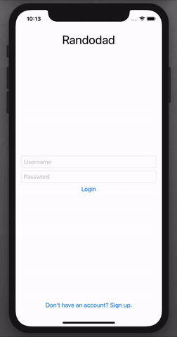

# Randodad
A Random Dad Joke app built with SwiftUI using AWS Amplify for authentication and an API for dad jokes.

## Why I made this app and what I learned

I created this app to learn how to integrate some AWS services into an iOS app. I learned about AWS Amplify and how to use Cognito to handle user authentication. Cognito handles everything from sign up and login fields to sending a 6 digital verification code through email to a new user that signs up. It's very cool to see the Cognito backend update in real time as a new user is added and verified. I also learned more about Swift and SwiftUI when building this. The last thing that I learned is how to use .plist files to hide API key's from the main app. I have a local .plist file on my computer that connects with the code to make the connection to the API work, but I did not upload the .plist file because I don't want others to use my API key. The Dad Jokes API I used is from Rapid API and it limits daily API calls to 50 calls/day for free, so I don't want to go over that limit for now! 

## Youtube Video

I talk about AWS Amplify and Cognito in this video as well as demo the app as a completely new user. You can view the video:
https://youtu.be/5cfMsoemWAE

Here is a 40 second gif of what the app looks like!

